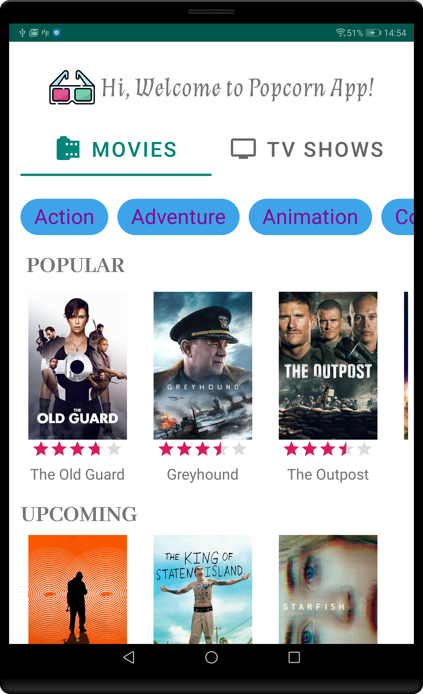
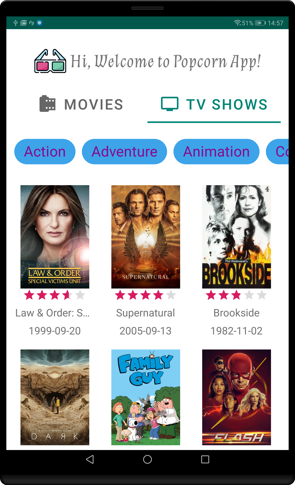
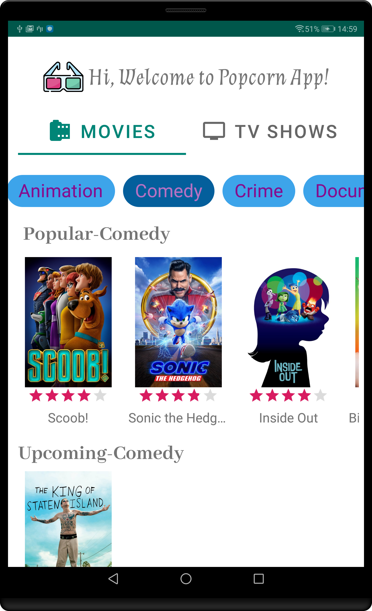
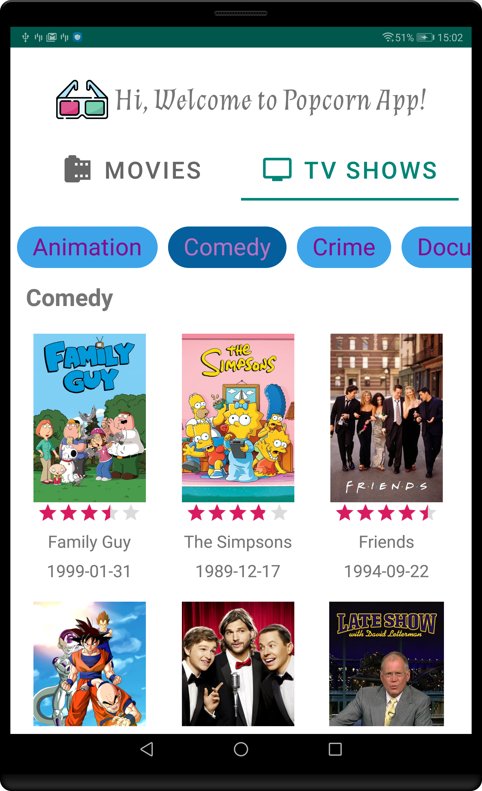
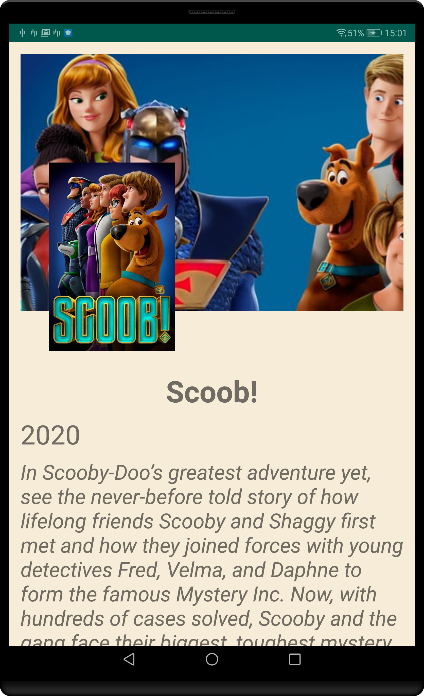

# PopcornApp
The PopcornApp developed using MVVM architecture on Kotlin which fetchs movies and tv shows from TMDB API

## Libraries Used
- **Foundation**
1. AppCompat
2. Android KTX 
3. Test 
- **Architecture** 
1. Data Binding 
2. Lifecycles 
3. LiveData 
4. ViewModel
- **UI**
1. Fragment 
2. Layout 
- **Third party**
1. Glide for image loading
2. Kotlin Coroutines for managing background threads with simplified code and reducing needs for callbacks

## Tests
I've tested these cases in my project;
1. Does popular movies service call when loadMovies() function call? 
2. Is the status be done when popular movies api service return success?
3. Is the upcoming movies return only future dates?
Tmdb api return tv show list but it doesn't filter by the date. When the data fetch, I'll filter by the date and show the screen. I've tested this case.  

## What could be improved?
- Add more unit and ui test
- Add repository
- Add Room Database
- Add more error handling

## Screenshots

